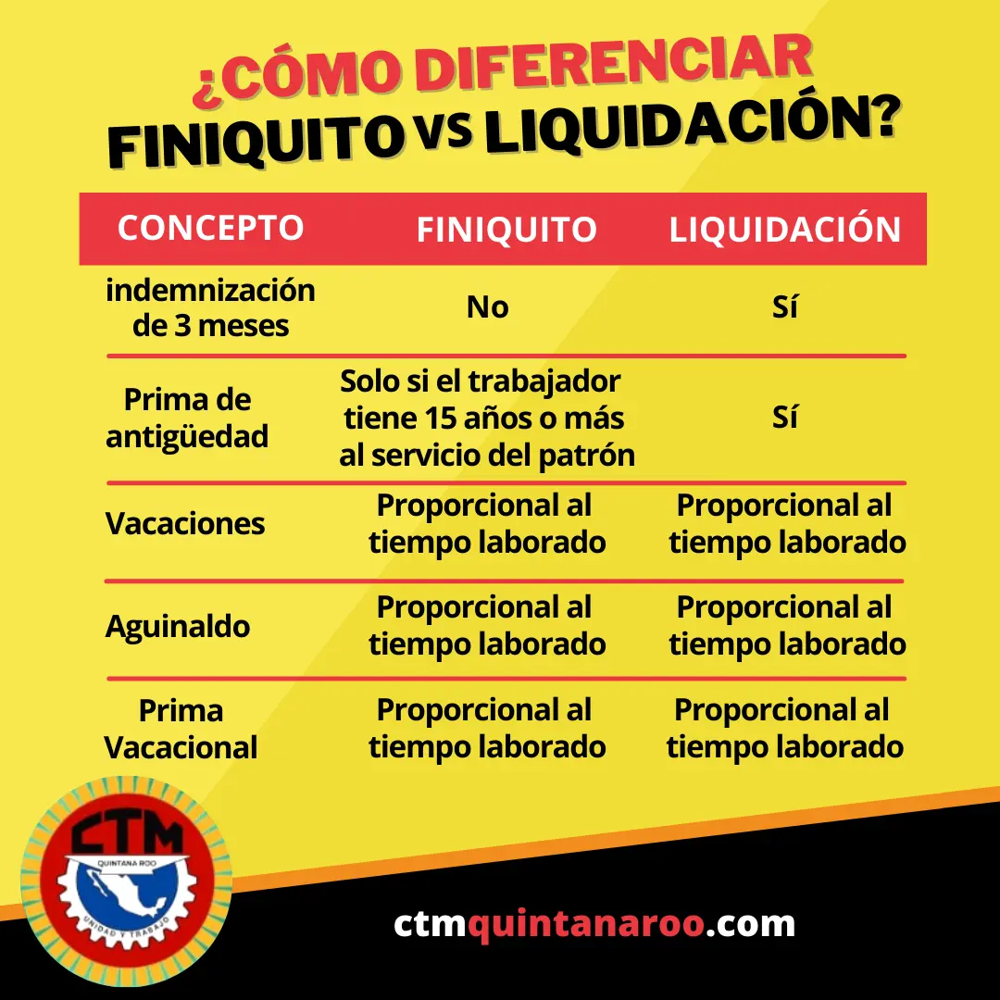

**Para que alguna de estas dos opciones pueda darse, deberán cumplirse una serie de condiciones.** 
Si has sido despedido, quizá te hayas preguntado qué derechos te corresponden como trabajador. Cuando la relación de trabajo llega a su fin, no sabes si recibirás **un finiquito o una liquidación.**
<!--truncate-->

**Lee aquí las diferencias:**

De acuerdo con la **Ley Federal del Trabajo,** tanto el trabajador como el patrón pueden rescindir del vínculo laboral, y deben cubrirse ciertas condiciones.

El patrón podrá rescindir el contrato a un empleado si este realiza ciertas acciones como el engaño, la falta de honradez, daños materiales, actos inmorales, entre otros motivos.

El patrón deberá entregar personalmente al trabajador, ya sea en el momento del despido o mediante un Tribunal competente, el **aviso de despido** dentro de los cinco días hábiles siguientes. Esto para acreditar que el despido es justificado.

En caso de no emitir la notificación correspondiente, por cualquiera de los dos métodos mencionados, significará una **separación no justificada** del trabajo.

En este caso le corresponde al patrón pagar **liquidación.** Para esto deben cumplirse también algunos requisitos, como que el empleador haya rescindido el contrato por reestructuración del área y no por motivos relacionados con el desempeño del trabajo.

La segunda está relacionada con el cierre de la empresa en la que laboras, o la desaparición del puesto que ocupas. Y la tercera condición es si renuncias a causa de una falta grave cometida por el patrón que te contrató.

La liquidación debe incluir tres meses de salario, prima de antigüedad, salarios vencidos (despido injustificado con límite de 12 meses desde la notificación del despido) y 20 días de salario por año trabajado (despido injustificado).

Por otro lado, el **finiquito** te lo otorgan cuando tú y tu patrón dan por terminada la relación laboral voluntariamente.

Este corresponde cuando renuncias, si termina tu contrato temporal o si rescindes del contrato por una falta grave cometida por tu empleador.

El finiquito debe incluir los días trabajados y no pagados en el mes. Si te pagan por quincena y renuncias el día 10, te corresponde el pago de los 10 días laborados y parte proporcional del aguinaldo y vacaciones.

En caso que hayas tenido contrato colectivo de trabajo, se deberán incluir los pagos proporcionales de las prestaciones incluidas en éste como bonos, vales, comisiones, caja o fondo de ahorro y utilidades.

Fuente: https://www.elfinanciero.com.mx/economia/si-me-despiden-me-corresponde-finiquito-o-liquidacion